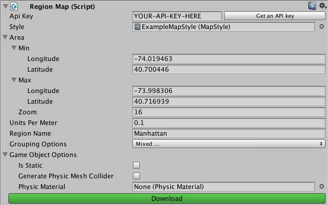

Region Map Editor
=================

To create a map in a scene, you create a GameObject with a `RegionMap` component. `RegionMap` has a custom editor that allows you to configure where and how the map is built.

RegionMap Options
-----------------

### Api Key

Enter your Mapzen API key. An API key enables access to Mapzen's vector tile service. If you don't have one already, you can click the button next to the field to go straight to the Mapzen developer site.

### Style

Select the `MapStyle` that you want to use for building this map. The `MapStyle` will determine which map features are built and how they are styled. See [MapStyleEditor.md](MapStyleEditor.md) for details.

### Area

Choose the area of Earth that this map should represent. The area is represented by a bounding box with a `Min` point and a `Max` point in longitude and latitude. The area also requires a `Zoom`. Higher zoom corresponds to more detailed geometry. Zoom 16 provides the maximum detail available in Mapzen vector tiles.

### Units Per Meter

Set the scale of map geometry in the scene. A value of `1` will make 1 unit in the Unity scene correspond to 1 meter in geographic space, `0.5` will make 1 unit correspond to 2 geographic meters, etc.

### Region Name

Set the name of the GameObject that will contain the map. If an object in the scene already exists with this name then it will be overwritten.

### Grouping Options

Choose how the map will be organized in the scene heirarchy. For each of the grouping options selected, the map will be split into seperate GameObjects according to that attribute.

### Game Object Options

Choose options for the GameObjects created to contain the map.

 - `Is Static` determines whether the resulting GameObjects use static lightmaps.
 - `Generate Physic Mesh Collider` determines whether the resulting GameObjects will have a RigidBody and MeshCollider for physics interactions.
 - `Physic Material` determines the PhysicsMaterial that will be used if physics mesh colliders are generated.

### Download

Press to retreive map data for the chosen area and construct GameObjects for the map. If the button is grey and inactive, make sure that you have entered values for `Api Key`, `Style`, and `Region Name`.
