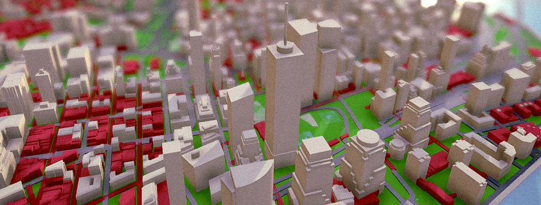

Tangram Unity
=============

Tangram Unity is a library of tools for using OpenStreetMap data in the Unity3D game engine. This repository contains the code and GUI tools along with an example scene that demonstrates how to use them.

This project requires Unity version 2017.1.1 or newer.

Quickstart
-----------

1. Create a [Mapzen API Key](https://mapzen.com/developers/sign_up)
2. Open the example scene `Assets/Scenes/RegionMapExample.unity` in Unity.
4. Select the `Map Builder` object in the scene and enter your API key in the "Api Key" field in the inspector.
4. Press the `Download` button in the inspector and wait a few seconds for the download to complete.

The scene should now contain geometry from New York City! To learn how to customize your own map with a different style or a different location, check out these documentation pages:

 - [Region Map Editor](Documentation/RegionMapEditor.md)
 - [Map Style Editor](Documentation/MapStyleEditor.md)

Roadmap
-------

- Terrain support
- Tile streaming
- Map data access from game objects
